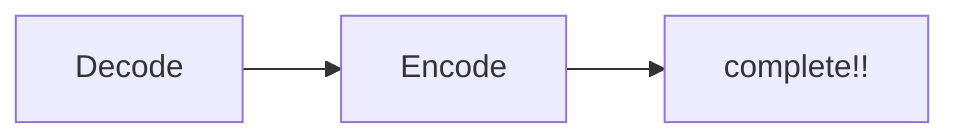

# 資料標記統一化 for yolo 
## 起因
多人共同標記資料的時候，可能會因沒溝通好，造成標記順序不一樣。所以就寫了一個這樣的程式來輔助，可以不用一個一個改，直接運行一次程式即可。
## 方法            


``` Decode ```: 分別進入data1、data2資料夾內搜尋所有標記的 .txt 檔，將其與內部資料夾中的classes.txt做 decode   
``` Encode ```: 將外層 classes.txt 當作一個 encode 的目錄，再將 data 資料夾內容encode回來，即可得到統一的標記順序
## 實際操作
1. 將data1、data2換成自己要的資料夾，及最外層的classes.txt換成主要參考。
2. 運行
3. 在data1、data2新建 label 、 image 資料夾，分別入已改正後的文字檔、圖片
4. 得到yolo可使用的資料
## 注意
* 資料夾名稱不要有"."
* 建議先建立一份備用檔，以免程式出錯
